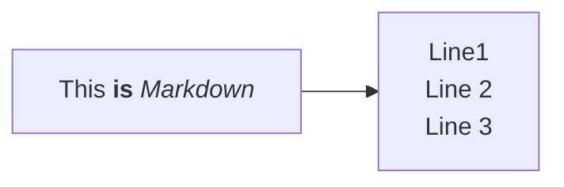

# Markdown Tutorial

## List of Videos

- Set up Github account
- Create new repository
- Create new markdown file
- Basics of markdown
  - Headings
  - Lists
  - Basic styling
    - Italics (*italicize*)
    - Bold (**bold**)
  - Links
    - [Thirteen Ways of Looking at a Blackbird](https://www.poetryfoundation.org/poems/45236/thirteen-ways-of-looking-at-a-blackbird)
    - [Markdown Cheatsheet](https://www.markdownguide.org/cheat-sheet/)
- Diagrams with Mermaid JS

